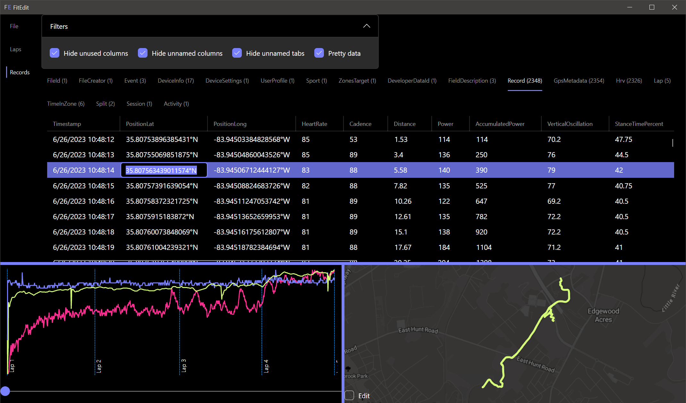
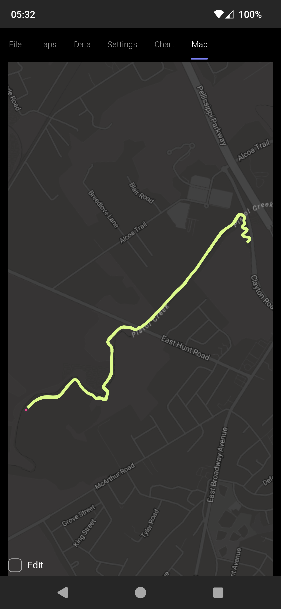

<main>
<h1>Whip your training data into shape!</h1>

Fix your buggy training data with FitEdit

<a class="cta-button" href="get.html">Start Free</a>

<section class="section">

FitEdit is a training data manager that keeps a local database of all your workouts.

      

FitEdit works on all your devices. View, edit, and repair your FIT files. Sync* between devices. Sync* with other platforms such as Garmin and Strava. <a href="features.html">See all features</a>
    
* Available with a subscription

</section>

Screenshots of FitEdit



</main>
