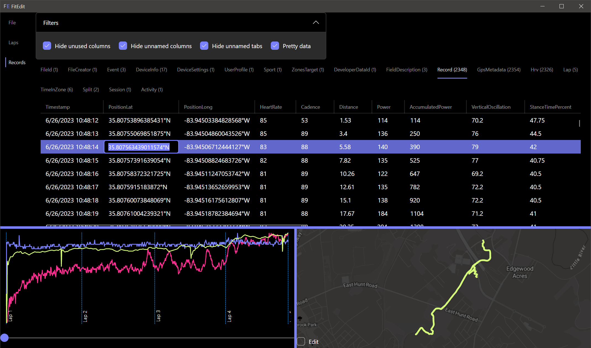

<main>
<h1>Whip your training data into shape!</h1>

Fix your buggy training data with FitEdit

<section class="section">
<h2>Fix these issues:</h2>

<ul>
<li>Workout won't upload</li>
<li>GPS glitches</li>
<li>Erratic or inaccurate treadmill pace</li>
<li>Inaccurate heart rate</li>
<li>Power drops</li>
<li>Missed lap key</li>
<li>Miscounted swim laps</li>
<li>...and much more</li>
</ul>

</section>

<a class="cta-button" href="get.html">Start Free</a>

 

Screenshot of FitEdit

</main>
