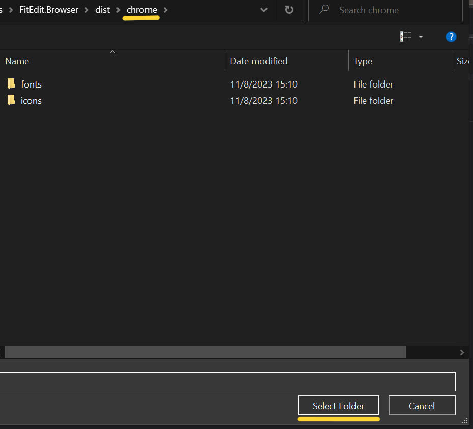
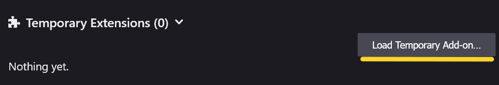
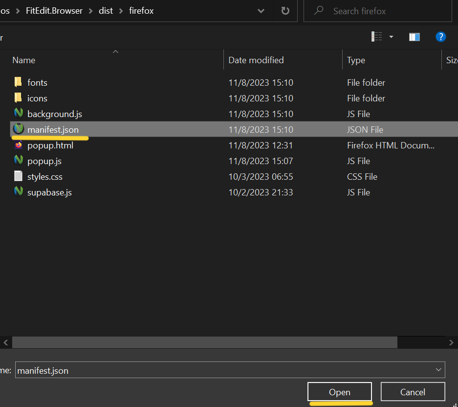
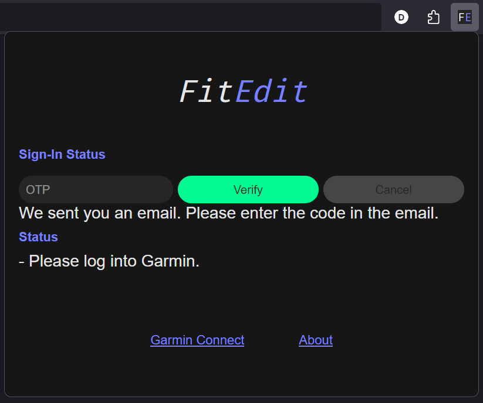
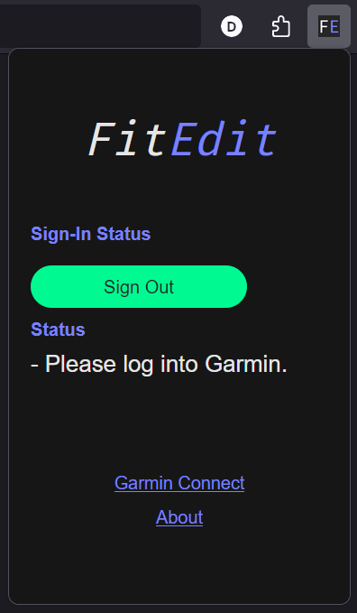
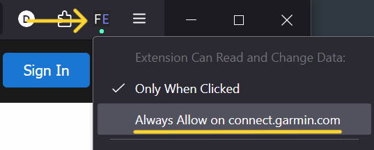

# Signing in to Garmin Connect

This page has the following contents:

- Introduction
- Automatic and Manual Cookie Sync
- Security
- Automatic Cookie Sync (Chrome)
  - Installing the Chrome Extension
  - Configuring the Chrome Extension
- Automatic Cookie Sync (Firefox)
  - Installing the Firefox Extension
  - Configuring the Firefox Extension
- Manual Cookie Entry
  - Get Cookies (Chrome)
  - Get Cookies (Firefox)
  - Enter Cookies in FitEdit

## Introduction

FitEdit offers extra features from within the app if you grant it access to your Garmin Connect account. These features include uploading activity files to Garmin Connect, editing activity titles and descriptions, and bulk download of activities from Garmin Connect. If you don't want to use these features, then you don't need to take the following steps.

## Automatic Cookie Sync and Manual Cookie Entry

FitEdit uses the same web cookies stored in your browser to access Garmin Connect. You can provide FitEdit with these cookies in two ways: automatically and manually. 

The automatic way involves installing the FitEdit web browser extension, which supports Google Chrome and Mozilla Firefox. Automatic cookie sync is useful because cookies expire after some time. The extension reads your Garmin Connect cookies every few minutes and syncs them to your FitEdit account in the cloud. The update gets pushed from the cloud to your local running FitEdit app. That way FitEdit almost always has valid cookies.

The manual way involves copy-pasting values from the browser into FitEdit. The values expire after some time. When this happens, you will have to update the cookie values. FitEdit will notify you of this with a red dot over the Settings tab. 

## Security

Always treat cookies with the same care as you would your username and password. Someone with them has access to your data on Garmin Connect. 

FitEdit stores your cookies securely with your account in the cloud. FitEdit does not send them any other party, per our privacy policy. If you don't want FitEdit to have access to your Garmin Connect cookies, do not perform the following steps. If you perform the following steps and later wish to revoke access, simply remove the extension if installed and press "sign out" in the app. 

For extra security, after removing the extension, you can sign out of Garmin Connect, which will expire any cookies in that browser. When you sign back in, FitEdit will not sync the new cookies.

## Automatic Cookie Sync (Chrome)

There are two steps: installing the extension and configuring the extension.

### Installing the Chrome extension

The FitEdit extension will be added to the Chrome Web Store soon. In the meantime, you can perform a manual installation. Download the [extension zip file](https://releases.fitedit.io/browser/extension/chrome.zip) and extract it somewhere, for example in your Downloads folder.

Open the extensions manager. _Kebab Menu => Extensions => Manage Extensions_
{:.center}

Click _Load Unpacked_

{:.center}

In the folder unzipped earlier, open the folder named 'chrome' and select it.
{:.center}

The extension is now installed and appears in the extensions menu.
{:.center}

### Configuring the Chrome extension

Configuring the extension involves signing in to your FitEdit account and signing in to Garmin Connect. Once signed in to both, the FitEdit extension can read the Garmin Connect cookies stored in the browser and store them securely with your account in our cloud provider.

Open the extension popup by clicking on the extension icon.

{:.center}

Enter the email address associated with your FitEdit account. If you don't have an account, it will be created.

{:.center}

FitEdit will email you a one-time password (OTP). Please find it in your email inbox (check your spam folder) and enter it in the provided field. 

{:.center}

With the OTP entered, click _Verify_.

{:.center}

After a short delay, the extension should be signed in to your FitEdit account.

{:.center}

Next, if you are not signed in to [Garmin Connect](https://connect.garmin.com), please do so.

{:.center}

{:.center}

Once signed in to Garmin Connect, FitEdit will read your Garmin Connect cookies and display them in the extension popup. It can take up to 15 seconds. If it seems to not be working, try closing and re-opening the extension popup. After the first sync, the extension checks for cookie changes every few minutes.

{:.center}

If you did not already have the FitEdit app running, launch it now and navigate to the _Settings_ tab. The Sign in status for Garmin should indicate OK.

{:.center}

## Automatic Cookie Sync (Firefox)

There are two steps: installing the extension and configuring the extension.

### Installing the Firefox extension

The FitEdit extension will be added to the FireFox Add-ons store soon. In the meantime, you can perform a manual installation. Download the [extension zip file](https://releases.fitedit.io/browser/extension/firefox.zip) and extract it somewhere, for example in your Downloads folder.

Open the extensions manager. _Hamburger Menu => Add-ons and themes_

{:.center}

Click on the settings cog and select _Debug add-ons_

{:.center}

Click _Load Temporary Add-on_

{:.center}

In the folder unzipped earlier, open th efolder named 'firefox' and select the file _manifest.json_.
{:.center}

The extension is now installed and appears in the extensions menu.
{:.center}

### Configuring the Firefox extension

Configuring the extension involves signing in to your FitEdit account and signing in to Garmin Connect. Once signed in to both, the FitEdit extension can read the Garmin Connect cookies stored in the browser and store them securely with your account in our cloud provider.

Open the extension popup by clicking on the extension icon.

{:.center}

Enter the email address associated with your FitEdit account. If you don't have an account, it will be created.

{:.center}

FitEdit will email you a one-time password (OTP). Please find it in your email inbox (check your spam folder) and enter it in the provided field. 

{:.center}

With the OTP entered, click _Verify_.

{:.center}

After a short delay, the extension should be signed in to your FitEdit account.

{:.center}

Next, navigate to [Garmin Connect](https://connect.garmin.com) to grant the extension permission. The extension may notify you that it needs permission to access your data at connect.garmin.com. You must explicitly grant this permission in Firefox.

{:.center}

When you navigate to Garmin Connect, the extension will show a green dot to indicate it is requesting permission.

{:.center}

Right-click on the extension icon and select "Always Allow on connect.garmin.com".

{:.center}

Next, sign in to Garmin Connect if you are not already signed in.

{:.center}

{:.center}

Once signed in to Garmin Connect, FitEdit will read your Garmin Connect cookies and display them in the extension popup. It can take up to 15 seconds. If it seems to not be working, try closing and re-opening the extension popup. After the first sync, the extension checks for cookie changes every few minutes.

{:.center}

If you did not already have the FitEdit app running, launch it now and navigate to the _Settings_ tab. The Sign in status for Garmin should indicate OK.

{:.center}

## Manual Cookie Entry

Follow these steps to manually copy-paste cookie values from your web browser into FitEdit. FitEdit uses the following Garmin Connect cookies:

- _GARMIN-SSO-CUST-GUID_
- _SESSIONID_

Note that while the _GARMIN_SSO_CUST_ID_ does not change unless you sign in with a different Garmin Connect account, the _SESSIONID_ expires after some time, usually a few days.

### Get Cookies (Chrome)

Open the developer tools. _Kebab Menu => More tools => Developer tools_ 

{:.center}

{:.center}

The developer tools pane appears. Click on the _Application_ tab. On the left pane, under _Storage_, expand _Cookies_. Select _https://connect.garmin.com_. Copy the values associated with the cookie names _GARMIN_SSO_CUST_ID_ and _SESSIONID_.

{:.center}

{:.center}

Enter the values into FitEdit. See below for instructions.

### Get Cookies (Firefox)

Open the web developer tools. _Hamburger Menu => More tools => Web Developer Tools_ 

{:.center}

{:.center}

{:.center}

The web developer tools pane appears. Click on the _Storage_ tab. On the left pane, expand _Cookies_. Select _https://connect.garmin.com_. Copy the values associated with the cookie names _GARMIN_SSO_CUST_ID_ and _SESSIONID_.

{:.center}

{:.center}

Next, enter the values into FitEdit. See below for instructions.

### Enter Cookies in FitEdit

To enter cookie values in FitEdit, start FitEdit. Navigate to the _Settings_ tab, and scroll down to _Integrations_. Under _Garmin Connect_, enter the value for _GARMIN_SSO_CUST_ID_ in the text box for _SSO ID_. Then, enter the value for _SESSIONID_ in the text box for _Session ID_. Click _Sign in to Garmin_. 

{:.center}

After a few seconds, you should be signed in.

{:.center}
