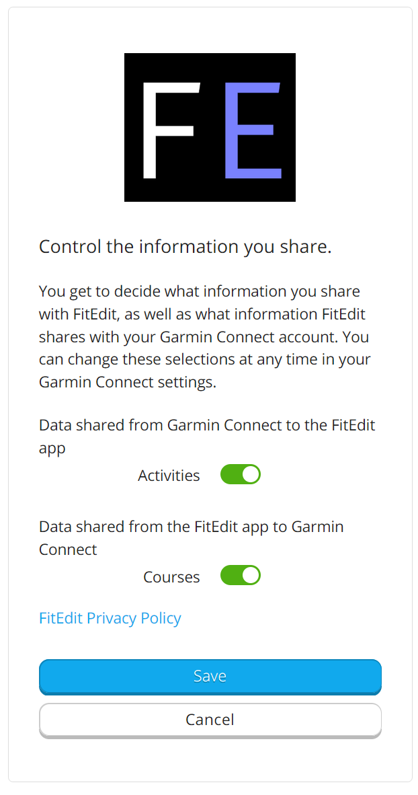
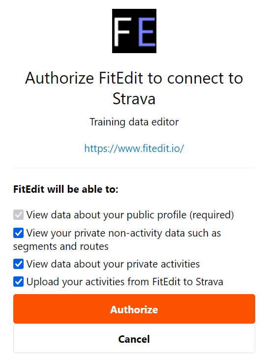

<main>

<section class="section">
  <h2>User Agent Terms</h2>

  
FitEdit provides integrations with various third parties. These integrations improve your experience using FitEdit, for example by enabling the import or export of your data to or from that service.

  <h3>Acknowledgement and Consent</h3>

  
By providing your third-party login credentials, for example for Garmin, Strava, or another integration, you understand and consent that FitEdit stores your credentials and becomes your user agent to interact with that service on your behalf. You also acknowledge that the third party may make changes at any time to their services which can prevent FitEdit from working with that service.
  

  <h3>What is a User Agent</h3>
  

    According to <a href="https://developer.mozilla.org/en-US/docs/Glossary/User_agent">Mozilla</a>, a trusted source of information on the web, a <i>User Agent</i> is "a computer program representing a person, for example, a browser". They go on to say that "besides a browser, a user agent could be...another app accessing the web."
  

  

    When you log in to a web service such as Garmin Connect or Strava, you entrust your username and password to a browser such as Chrome, Edge, Safari, or Firefox, and the browser interacts with the online service on your behalf. That makes the browser your user agent.
  

  

    FitEdit like a web browser becomes your user agent when you entrust it with your credentials to web services. FitEdit securely stores your credentials, and you can access the features of these services through FitEdit, just the same as a web browser.
  

  <h3>Garmin Connect</h3>

  

    
  

  

    There are two ways that FitEdit integrates with Garmin Connect. The first way is through a <i>consent page</i>. From the FitEdit app, you get redirected to a page on Garmin Connect where you give FitEdit permission to access your data.
  

  

    
     
    <i>Above: Garmin Connect consent page</i>
  

  

    After giving consent, Garmin will tell FitEdit when you upload activities to Garmin Connect or perform activity edits such as changing the title or description. 
  

  

    The Garmin API is limited. For example, Garmin does not give FitEdit permission to upload or delete activities. To enable these features and more in FitEdit, you must allow FitEdit to become your user agent by signing in with your Garmin Connect username and password.
  

  <h3>Strava</h3>

  

    
  

  

    Like the Garmin integration, you can provide consent for FitEdit to access your data. After giving consent, Strava will tell FitEdit when you upload activities to Strava or make activity edits such as changing the title or description. Unlike Garmin, Strava does give FitEdit permission to upload activities.
  

  

    
     
    <i>Above: Strava consent page</i>
  

  

    However, the activity data provided by the Strava API is not as detailed as e.g. the FIT file from your watch. Strava also does not provide a way for FitEdit to delete activities. To enable FitEdit to download your full activity data, to delete activity data at your request, and more functionality, you must allow FitEdit to become your user agent by signing in with your username and password.
  

</section>
<main>
